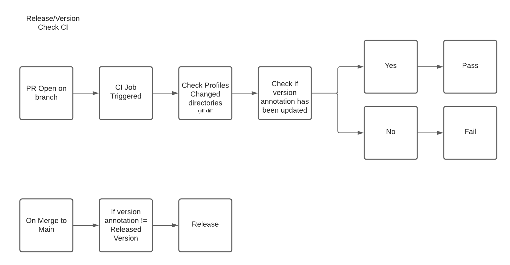

# Release Management


## Proposal
Currently (Oct. 7, 2021), the profiles spec does not include a version. Profiles are currently [versioned via git releases](https://profiles.dev/docs/author-docs/versioning). Without a version maintained in the profile spec, the release automation would not know the different between a major or minor release. 

I propose the following annotation is added to all released profiles with two CI jobs.   

```
apiVersion: weave.works/v1alpha1
kind: ProfileDefinition
metadata:
  name: gitops-enterprise-leaf-kind
  annotations:
    profiles.weave.works/version: v0.0.1
spec:
```
    
### Jobs Diagram




### Version Check CI

#### When will this job run
This job will run against main pull to check if a profile has changed.

#### What will this job do

* It will run through checking if any profiles have changed
* If the profile has changed, it will check if the annotation has been incremented.
    * Pass: If profiles have been changed and annotation has been incremented
    * Fail: If profiles have been changed and annotation has NOT been incremented

### Release CI

#### When will this job run
This job will run against when merged into main.
     
#### What will this job do

* It will run through checking if any profiles annotation versions are NOT Released
* Release profile